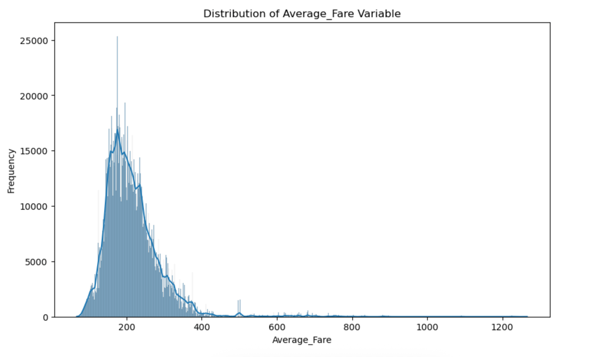
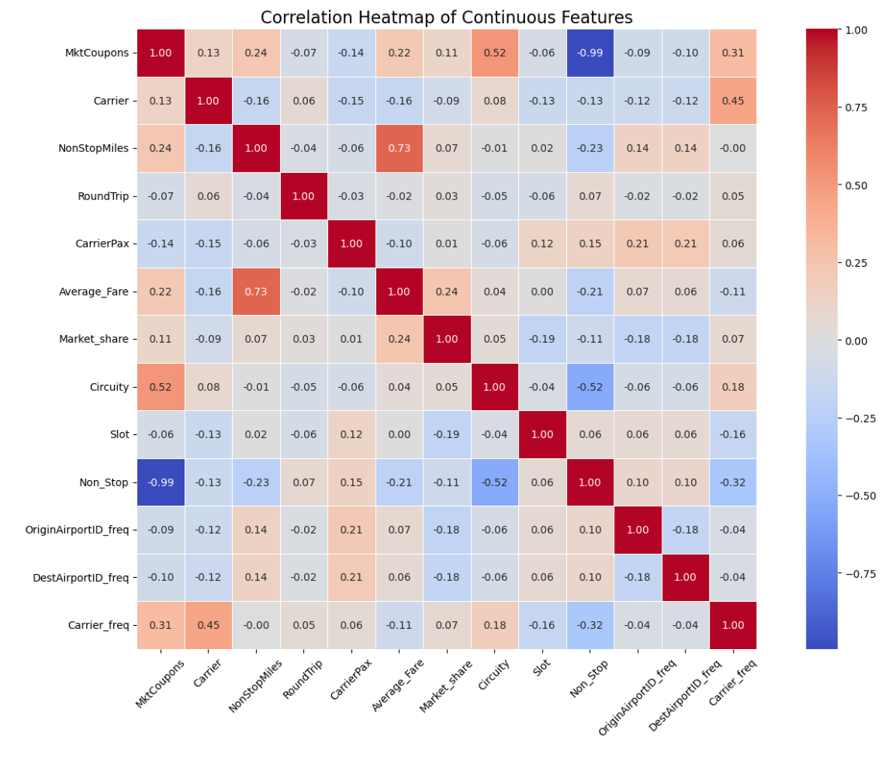
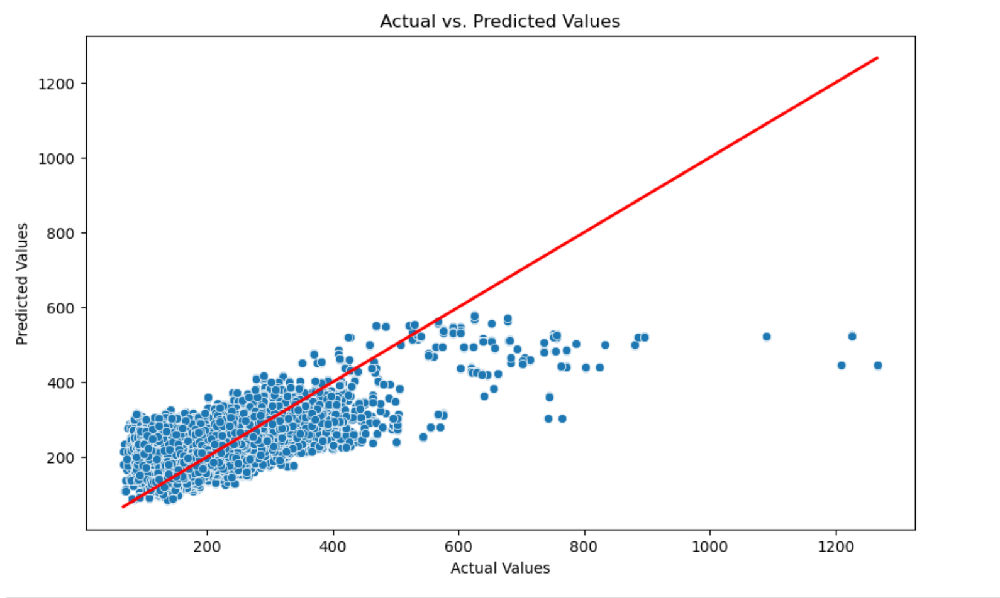

# UCB-AIML-Final-Capstone
Final submission for UCB AI/ML 2025 capstone

# Data driven prediction of air fare

**Link to github repo** https://github.com/guptakamit040880/UCB-AIML-Final-Capstone
**Link to notebook** https://github.com/guptakamit040880/UCB-AIML-Final-Capstone/blob/main/airFare_regression.ipynb

## Problem Statement

Finding the best airfare has been desired by everyone but not always available to all. In this project we will try to predict the best airfare based on historical data.

## Data Understanding

To understand the pattern of air fare, we have a dataset derived from publicly available sources provided by the US Department of Transportation Bureau of Transportation Statistics (BTS). It combines and processes data from two major sources — the DB1B and T-100 datasets. Along with cleaned BTS data, the dataset features additional variables that help explain fare differences across markets, such as competition intensity, circuity and existence of multiple airports within the origin, destination, or both.

## Objectives

Understand the relationship between various features and average airfare. Build and evaluate multiple regression models to predict the best average airfare. Provide actionable insights based on model findings.

## Distribution of Average_Fare Variable


## Modeling and performance

Linear Regression: RMSE = 44.7069, R2 = 0.6276\
Ridge Regression: RMSE = 44.7069, R2 = 0.6276\
Lasso Regression: RMSE = 45.1675, R2 = 0.6199\
Elastic Net Regression: RMSE = 46.6472, R2 = 0.5946


**Linear and Ridge Regression** has the best performance among the four models with the lowest RMSE and the highest R2 value. It is the most suitable model for this dataset based on the given metrics.

**RMSE (Root Mean Squared Error) = 44.7069:** This value indicates the average error in the predictions. In this context, it means that on average, the model's predictions are off by about 44.71 units from the actual values of average fare.

**R2 (R-squared) = 0.6276:** This value indicates that approximately 62.76% of the variance in the target variable (average fare) is explained by the features in the model. While this is a moderate level of explanation, it also indicates that there is still a significant amount of unexplained variance, suggesting room for model improvement.

## Linear Regression Coefficients:

```markdown
MktCoupons                 13.147811
OriginCityMarketID          0.904572
DestCityMarketID           -0.073402
OriginAirportID            -1.127701
DestAirportID              -0.878606
Carrier                     2.526193
NonStopMiles               39.983779
RoundTrip                   0.703659
ODPairID                   -1.434764
Pax                       -16.709535
CarrierPax                  5.971353
Market_share                7.394271
Market_HHI                  4.665953
LCC_Comp                  -11.131410
Multi_Airport               2.914628
Circuity                    2.088194
Slot                        2.759327
Non_Stop                    8.975253
MktMilesFlown               9.893920
OriginCityMarketID_freq    -4.174969
DestCityMarketID_freq      -4.846638
OriginAirportID_freq        5.003250
DestAirportID_freq          5.274419
Carrier_freq               -7.378940
ODPairID_freq              11.502694
```

## Correlation heatmap:



## Actual vs Predicted Fare:



## Conclusion

Based on above model **Non Stop flights** has the maximum impact on average fare. Next comes the **Airline** operating frequency on the selected route. **Time slot** also adds up significant into average fare, more desirable slots typically cost more money.
